# AWS Platform Architecture

This platform is built as a small, clear, and private AWS system for a web application that needs four things at the same time: a public API, a relational database, private file storage, and simple operations. The design uses managed services as much as possible, but it does not remove control. The core idea is simple: keep public traffic at the edge, keep business logic in serverless compute, keep state in managed data services, and keep private paths inside AWS networking.

The system is centered on one request path. A browser or client sends a request to the public API. API Gateway receives the request and sends it to a Lambda function. That Lambda function runs a Django backend from a container image stored in Amazon ECR. The function reads and writes relational data in Amazon RDS for PostgreSQL. When the backend needs to store images or documents, it writes objects to a private Amazon S3 bucket. Public media is not read from S3 directly. It is served through Amazon CloudFront, which is allowed to read the bucket through Origin Access Control. Secrets such as the database password and the Django secret key are not stored in plain Lambda environment variables. They are stored in AWS Systems Manager Parameter Store as SecureString values and are read at runtime.

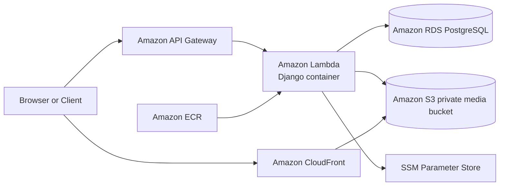

## The Services and Their Roles

Amazon API Gateway is the public front door. It gives the system one public API endpoint, handles the request entry point, and passes traffic to Lambda. This is useful because the backend does not need to run on a public server all day.

AWS Lambda is the compute layer. It runs the Django backend only when requests arrive. This matches a small traffic profile well, because the platform pays for execution time instead of paying for always-on application servers.

Amazon ECR is the container registry. The Django backend is packed as a container image and stored there. This gives a stable deploy artifact and makes the runtime close to what the application expects in local development.

Amazon RDS for PostgreSQL is the relational data layer. It stores the application data in a managed PostgreSQL service. A relational database is a good fit here because the application has structured entities, admin workflows, and data relations that are easier to model with SQL than with a key-value store.

Amazon VPC is the private network. Lambda and RDS live inside that private network. This matters because database traffic should not cross the public internet.

Amazon S3 is the object store. It keeps uploaded images and files. It is durable, cheap, and much better for media than storing files on the backend filesystem.

Amazon CloudFront is the public media edge. It stands in front of S3. This improves caching, keeps the bucket private, and gives one clean public URL shape for media.

AWS Systems Manager Parameter Store is the secret store. It holds the PostgreSQL password and the Django secret key as SecureString values. This removes plaintext secrets from normal runtime config.

AWS IAM is the permission system. It is used to express least-privilege access, such as “Lambda may write to this S3 bucket” or “Lambda may read only these two SSM parameters.”

Terraform is the infrastructure control plane. It defines the network, backend runtime, database placement, and media platform as code. This turns cloud resources into a repeatable design instead of a series of manual console clicks.

## The Main Data Paths

The platform has three important data paths, and each path has a different goal.

The first path is the application request path. This is the path for normal API work. The goal is to keep the public edge simple and keep the application private.

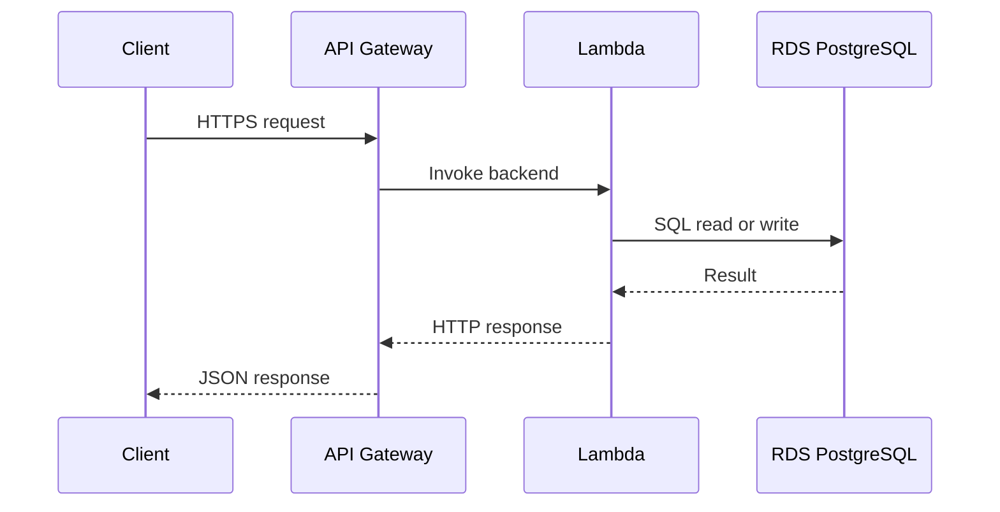

The second path is the media upload path. The goal is to keep uploads durable and separate from compute.

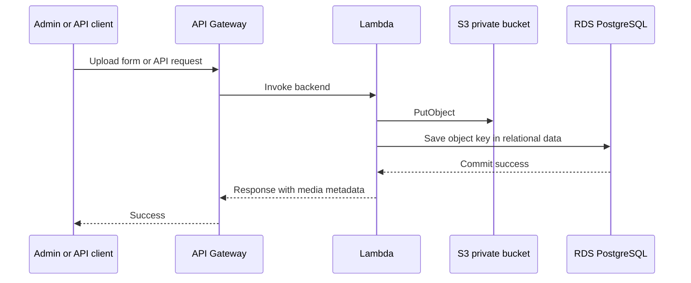

The third path is the media read path. The goal is to let the public read files without giving the public direct access to the bucket.

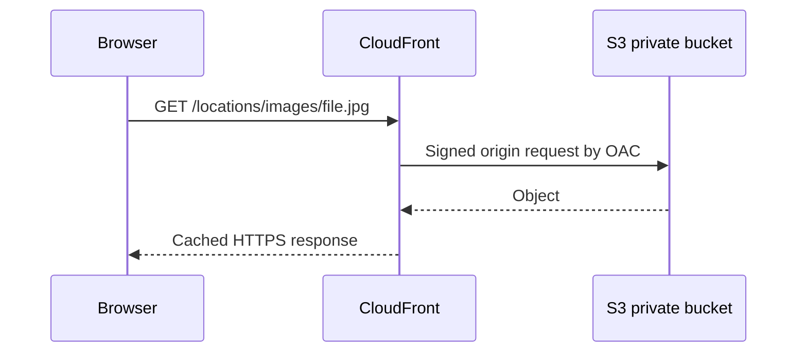

These three paths are linked tightly. The API path owns business rules. The upload path stores media safely. The read path serves media fast and cheaply. No path tries to do the job of another path.

## Network Design

The network uses one custom VPC in `ap-southeast-1`. The design is private by default. The application subnets are private. The database subnets are private. There is no NAT Gateway in the normal path. This is a deliberate cost choice.

The VPC CIDR is `10.20.0.0/22`, with one secondary CIDR block `10.20.4.0/24`. Two app subnets are used for Lambda in `ap-southeast-1a` and `ap-southeast-1b`. Three database subnets are used for RDS in `ap-southeast-1a`, `ap-southeast-1b`, and `ap-southeast-1c`. That third database subnet exists because RDS subnet groups must cover enough Availability Zones for stable placement rules.

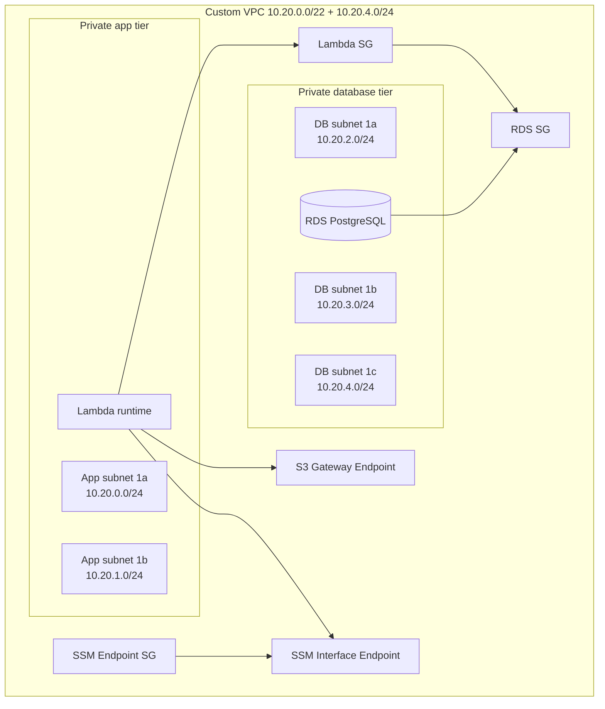

The choice to avoid NAT is important. NAT is easy to understand, but it adds steady hourly cost and per-GB processing cost. This system does not need a general path to the public internet from inside the VPC. It needs only two private service paths: one to S3 and one to SSM. Because of that, the design uses an S3 Gateway Endpoint and an SSM Interface Endpoint.

This decision has a clear trade-off. The cost is lower and the egress surface is smaller, but the network becomes more explicit. If the backend later needs another AWS service from inside the VPC, that service must be made reachable on purpose, usually through another endpoint.

## Compute Design

The backend runs as a Lambda container image. This is different from a plain zip function, and that choice is intentional. A Django backend with PostgreSQL drivers, image handling, and system-level dependencies is easier to package as a container image than as a small zip file. ECR stores the image. Lambda runs the image on demand.

This design keeps the backend simple to release. The deploy unit is one image. The infrastructure unit is one Lambda function with its networking, IAM, environment variables, and tracing mode managed by Terraform. The image itself is allowed to roll independently from infrastructure. In Terraform, the Lambda resource ignores image URI drift on purpose, so code release and infrastructure change do not fight each other.

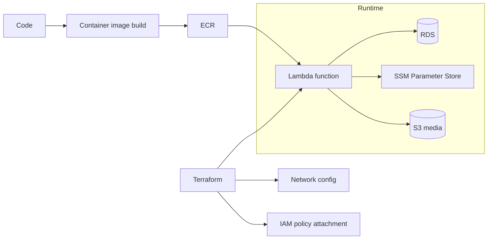

The main trade-off here is cold start. Container-based Lambda is very flexible, but it is not the lowest-latency compute model. That trade-off is acceptable because the traffic profile is small and the system value is in simpler operations, lower idle cost, and less always-on compute management.

## Data Design

PostgreSQL on RDS is used as the system of record. The instance is a `db.t3.micro`, single-AZ, with `gp3` storage. Storage starts at 20 GB and can grow with autoscaling. This is a careful small-production shape. It is not overbuilt, but it is not casual either. The database is private, encrypted, and reachable only from the Lambda security group.

The important part is not only “use RDS.” The important part is that the database sits behind clear boundaries.

The database is not public. The database security group allows port `5432` only from the Lambda runtime security group. The database subnet group points only to private database subnets. The database still has normal managed features such as automated backups, encryption at rest, and Performance Insights.

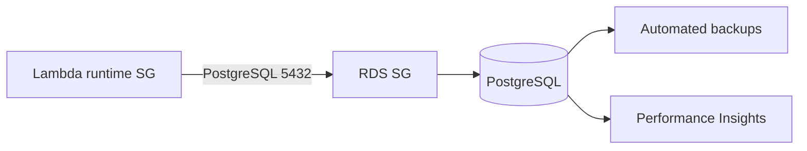

This choice also has a trade-off. RDS carries a fixed monthly cost, unlike a purely serverless key-value service. But the benefit is strong: SQL is a better fit for relational application data, admin flows, and clear schema rules. For this workload, the operational clarity is worth the fixed database cost.

## Media Design

Media is handled as a first-class platform concern, not as a side effect of the backend. The backend writes files to S3. S3 stays private. CloudFront is the only public reader. That means the system separates writing from reading.

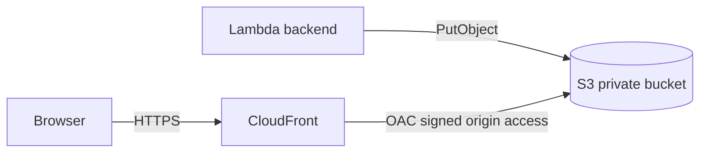

This shape is better than making the S3 bucket public. A public bucket is simple for the first day and painful after that. A private bucket with CloudFront is slightly more work, but it creates a clean boundary. The bucket becomes storage. CloudFront becomes the public delivery layer. The backend becomes the only writer.

The S3 bucket is hardened in a few ways. Public access is blocked. Object ownership is set to `BucketOwnerEnforced`, so the design does not depend on old ACL behavior. Encryption at rest is enabled. Versioning is enabled. Lifecycle rules remove incomplete multipart uploads and old noncurrent versions. The bucket policy denies insecure transport and allows only the CloudFront distribution to read objects.

That last point matters. Media is public to users, but the bucket is not public to the internet. Those are not the same thing.

## Secret Design

The platform stores `POSTGRES_PASSWORD` and `DJANGO_SECRET_KEY` in AWS Systems Manager Parameter Store as SecureString parameters. The Lambda environment does not store the secret values. It stores only the parameter names. At runtime, the backend reads those parameters through the SSM API.

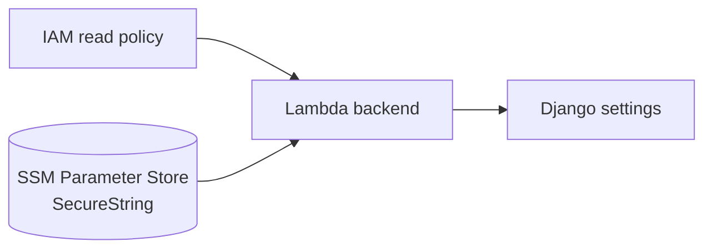

This choice is deeply about blast radius. Plain environment variables are easy to use, but they spread secrets into more places than needed. Parameter Store keeps the secret values in a service that is made for that job. IAM then limits which runtime may read them. The backend runtime policy is not broad. It allows only `GetParameter` and `GetParameters` on the named parameters, plus the KMS decrypt path only through SSM.

Parameter Store was chosen instead of Secrets Manager mainly for cost discipline. The system needs a small number of secrets, not advanced rotation workflows. Parameter Store SecureString Standard gives the right security shape with lower steady cost.

## Security Design

Security is not one feature in this system. It is the result of several layers working together.

The first layer is network isolation. Lambda and RDS are both private. The database is not public. The application subnets are not public. Only the API edge and the CloudFront edge face the internet.

The second layer is identity and least privilege. The Lambda execution role gets only the permissions it needs: write access to the media bucket, read access to two named SSM parameters, and the usual runtime permissions for Lambda. The media bucket itself accepts writes from the backend role and read access only from CloudFront. IAM is used to describe intent, not just to “make it work.”

The third layer is secret handling. Secrets are not kept as plain text in general runtime config. They are kept in SSM as SecureString values. This makes it easier to reason about who can read secrets and where they live.

The fourth layer is encryption and transport rules. RDS is encrypted. S3 is encrypted. HTTPS is used at the public edge. The S3 bucket policy denies insecure transport. CloudFront reads the private bucket with signed origin access, not with public bucket access.

The fifth layer is boundary separation. The network stack owns the VPC and security groups. The backend stack owns Lambda runtime config. The database stack owns the RDS instance. The media stack owns S3 and CloudFront. This sounds like an infrastructure organization detail, but it is also a security detail. Clean ownership reduces human mistakes.

## Cost Design

The cost strategy is not based on one trick. It comes from several small choices that work well together.

The backend uses Lambda because traffic is small and request-driven. This avoids paying for idle application servers. The media tier uses S3 because object storage is cheap and durable, and it uses CloudFront with `PriceClass_100` to limit edge cost to a smaller set of regions. The database uses `db.t3.micro` because the workload is light and relational consistency matters more than raw throughput. The network avoids NAT Gateway because NAT would add fixed hourly cost and per-GB cost even when the system does not really need open outbound internet.

This is the most important cost decision in the whole design: do not buy a wide network path when a narrow private path is enough.

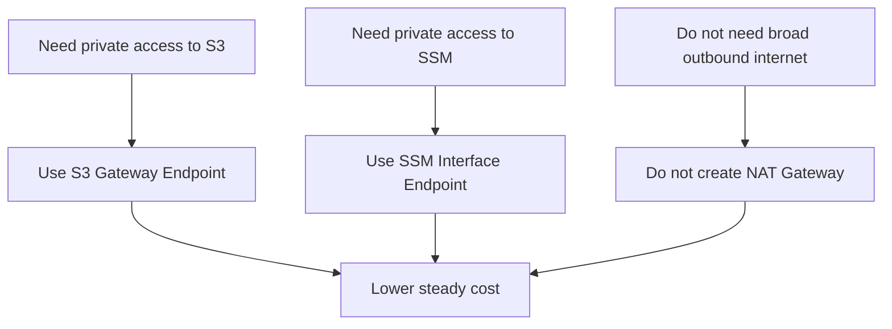

There is a trade-off here. A NAT Gateway would make future outbound needs easier because many things would “just work.” But that is exactly why NAT becomes expensive in small systems. It solves many problems, including problems that do not exist. This design solves only the problems the application actually has.

The same reasoning appears in secret management. Parameter Store SecureString Standard is cheaper than Secrets Manager for a small set of static secrets. The same reasoning appears in compute. Lambda removes idle cost but accepts some cold start behavior. The same reasoning appears in media. CloudFront in front of a private bucket is slightly more setup work than a public bucket, but it reduces future security cost and public surface area.

## Terraform Design

The Terraform layout follows ownership boundaries, not service names alone. This is a key design choice. It means each root manages one concern well, and remote state is used only where one concern must read the outputs of another.

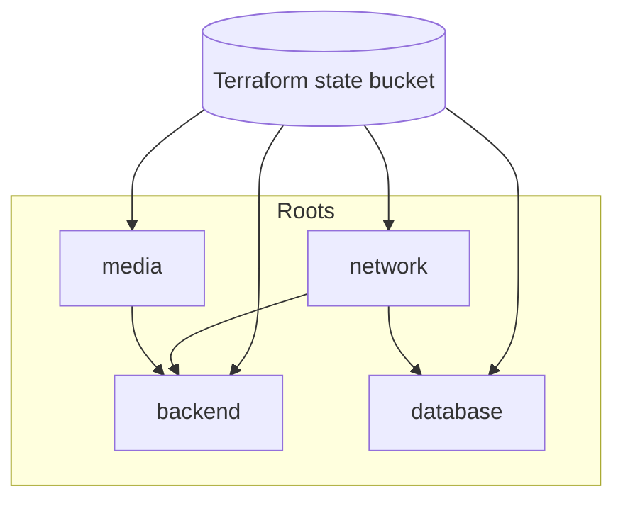

The `network` root owns the custom VPC, private subnets, route tables, gateway and interface endpoints, and dedicated security groups. The `backend` root owns the Lambda runtime, runtime environment variables, and IAM attachments needed by the function. The `database` root owns the RDS instance and reads the database subnet group and RDS security group from the network root. The `media` root owns the S3 bucket, CloudFront distribution, and media writer policy.

This split is worth doing because cloud systems fail at the boundaries. Storage, networking, compute, and secrets interact closely, but they do not change for the same reasons. A clean Terraform split lets each layer change without turning every plan into a full-platform event.

The Terraform state itself is stored in S3 with versioning. This matters because infrastructure code without stable state management is only half of an infrastructure system. State is part of the design.

## Why These Choices Fit Together

The best system designs feel simple because each part has one job and the jobs connect cleanly.

Lambda is used because compute should scale to traffic and not sit idle. RDS is used because the application needs clear relational data rules. VPC is used because database traffic should stay private. S3 is used because files do not belong on ephemeral compute. CloudFront is used because public file delivery should be fast and should not expose the bucket. Parameter Store is used because secret values should not live as plain config. Terraform is used because the system should be reproducible and reviewable.

None of these choices stands alone. Lambda inside a VPC leads to endpoint design. Private media leads to CloudFront origin access design. Secret handling leads to Parameter Store and IAM design. Cost control leads to “no NAT unless truly needed.” The architecture works because every choice supports the next choice.

## Closing View

This platform is a small but complete AWS system. It uses managed services where managed services remove low-value work. It keeps private things private. It keeps public things behind explicit edges. It uses infrastructure as code to make structure visible. Most of all, it treats cost, security, and clarity as linked design concerns instead of separate checklists.

That is the core engineering idea in the whole design: make the simple path the correct path.
